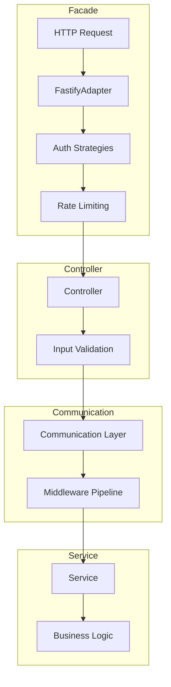
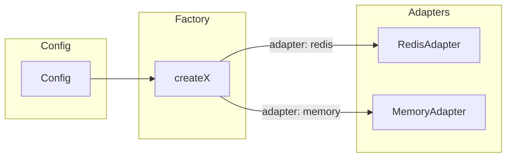

# Mariachi Framework Architecture

Mariachi is an LLM-optimized TypeScript backend framework with adapter-based abstractions. It provides a modular structure where external dependencies (databases, caches, message queues, third-party APIs) are hidden behind config-driven adapters, enabling vendor independence and testability.

## Three-Layer Architecture

Requests flow through three layers: **Facade** (HTTP/entry), **Controller** (routing and validation), and **Service** (business logic). Controllers delegate to services via the communication layer.

| Layer | Responsibility |
|-------|----------------|
| **Facade** | HTTP server (Fastify), auth strategies, rate limiting, route registration |
| **Controller** | Parse/validate input, call communication layer, return response |
| **Service** | Business logic, database access, external integrations |

## Package Overview

| Package | Purpose |
|---------|---------|
| `@mariachi/core` | Shared types, errors, context, container |
| `@mariachi/config` | Typed config, secrets, feature flags |
| `@mariachi/observability` | Logging (Pino), tracing (OTEL), metrics, error tracking |
| `@mariachi/lifecycle` | Startup/shutdown, health checks, bootstrap |
| `@mariachi/communication` | Inter-module communication, middleware pipeline |
| `@mariachi/database` | Drizzle ORM, PostgreSQL, repositories |
| `@mariachi/cache` | Redis, in-memory, distributed locks |
| `@mariachi/events` | Event bus, Redis Pub/Sub |
| `@mariachi/jobs` | BullMQ job queue, workers, scheduler |
| `@mariachi/auth` | JWT, API keys, RBAC |
| `@mariachi/tenancy` | Multi-tenant isolation |
| `@mariachi/rate-limit` | Redis sliding window rate limiting |
| `@mariachi/audit` | Append-only audit logging |
| `@mariachi/api-facade` | Fastify server adapter, auth strategies |
| `@mariachi/storage` | S3, local file storage |
| `@mariachi/notifications` | Email (Resend), in-app notifications |
| `@mariachi/billing` | Stripe billing, webhooks |
| `@mariachi/search` | Typesense, full-text search |
| `@mariachi/ai` | AI SDK, sessions, tools, prompts, agent loops |
| `@mariachi/integrations` | Third-party integration pattern |
| `@mariachi/testing` | In-memory test doubles, factories |
| `@mariachi/create` | Scaffolding, validation |
| `@mariachi/cli` | CLI binary |

## Monolith vs Microservice

Mariachi is designed as a **modular monolith**. All packages can live in one codebase and share the same process. The communication layer (`@mariachi/communication`) uses an in-process adapter by default, routing procedure calls directly to registered handlers.

For future scaling, the communication layer can be swapped for a transport adapter (e.g., message queue, gRPC) without changing controllers or services. The framework does not prescribe microservices; teams can extract services later if needed.

## Adapter Pattern

External dependencies are abstracted behind adapters. Each package exposes a factory (e.g., `createCache`, `createSearch`) that selects the implementation based on config.

**Example:** `createSearch(config)` returns `TypesenseSearchAdapter` when `config.adapter === 'typesense'`, or `MemorySearchAdapter` when `config.adapter === 'memory'`. Tests use in-memory adapters; production uses Redis, PostgreSQL, Stripe, etc.

Adapters implement a common interface. The factory is the single place that maps config to implementation, keeping application code vendor-agnostic.
