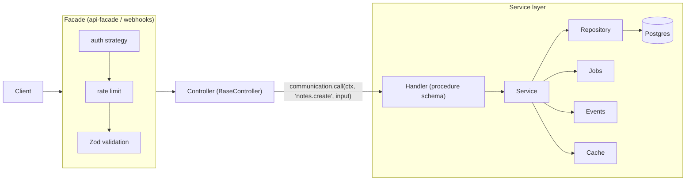

# Architecture

## Layers

A request crosses three layers. Each has one job and a hard import boundary.


```mermaid
flowchart LR
  Client --> Facade
  subgraph Facade["Facade (api-facade / webhooks)"]
    direction TB
    A[auth strategy] --> R[rate limit] --> V[Zod validation]
  end
  Facade --> Controller["Controller (BaseController)"]
  Controller -->|"communication.call(ctx, 'notes.create', input)"| Handler
  subgraph Service layer
    Handler["Handler (procedure schema)"] --> Service --> Repository --> DB[(Postgres)]
    Service --> Jobs & Events & Cache
  end
```

| Layer | Owns | May import | Must not import |
| --- | --- | --- | --- |
| Facade | Transport, auth, rate limits, CORS, request context, OpenAPI | `api-facade`, `server`, `webhooks`, auth adapters | Database, services |
| Controller | Route shapes and Zod schemas; maps HTTP to a procedure | `api-facade`, `src/contracts/*` | Services, repositories, database packages |
| Service | Business rules, data access, side effects | Repositories, `jobs`, `events`, `cache`, integrations | HTTP frameworks, `server`, `api-facade` |

Controllers reach services **only** through `@mariachi/communication`. The in-process adapter is a
function call with validation, scope checks, timeouts and tracing around it; the boundary is what lets
a module move to another process later without touching controllers. `mariachi validate` enforces
all of the boundaries above.

## Project layout

`mariachi init` creates this layout, and generators and `validate` assume it:

```
src/
  main.ts                    composition root (config → lifecycle → resources → communication → HTTP)
  contracts/<domain>.ts      Zod schemas + `Procedures` type augmentation, shared by controllers and handlers
  api/controllers/           BaseController subclasses; index.ts lists them
  services/<domain>/         <domain>.service.ts, .repository.ts, .handler.ts, .service.test.ts
  services/index.ts          constructs services and registers their handlers
  schema/                    defineTable() tables; index.ts re-exports all of them for `mariachi db`
  seeds/index.ts             defineSeed() seeds
  jobs/                      defineJob() definitions; index.ts lists them
  integrations/<vendor>/     typed clients for third-party APIs
```

Contracts are the only thing controllers and services share. They hold schemas and types, not code.

## One process, many roles

The composition root decides what a process runs. The generated `main.ts` runs the API and the job
worker together. To split them later, create a second entry point that bootstraps the same resources
and calls `jobs.start()` without starting the HTTP server. Services and handlers don't change.

## Adapters

Every external system sits behind an interface with a factory that picks the implementation from
config (`createCache({ adapter: 'redis' | 'memory' })`, `createEventBus(...)`, `createJobQueue(...)`).
Memory adapters exist for tests and local development. See
[adr/001-adapter-pattern.md](./adr/001-adapter-pattern.md) and [patterns.md](./patterns.md).

## Multi-tenancy

`Context.tenantId` is the tenant boundary. Tables with a `tenantId` column are tenant-scoped:
`DrizzleRepository` adds the tenant filter to every query and sets it on insert, and it throws
`database/tenant-required` when the context has no tenant. Code that must cross tenants (admin tools,
maintenance jobs) opts in explicitly with `repository.crossTenant()`.
